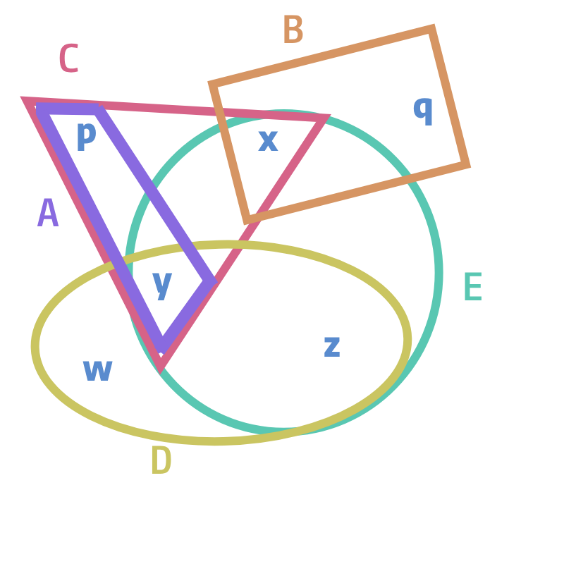
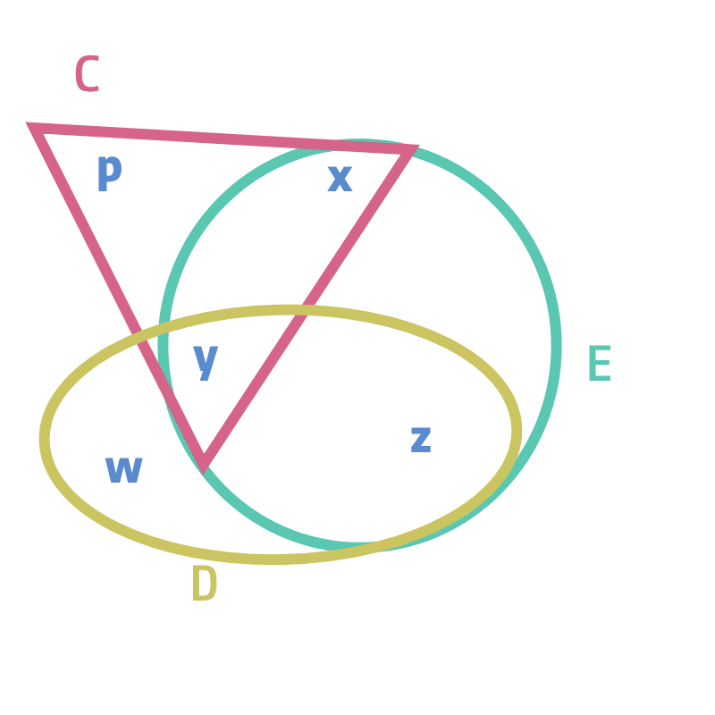
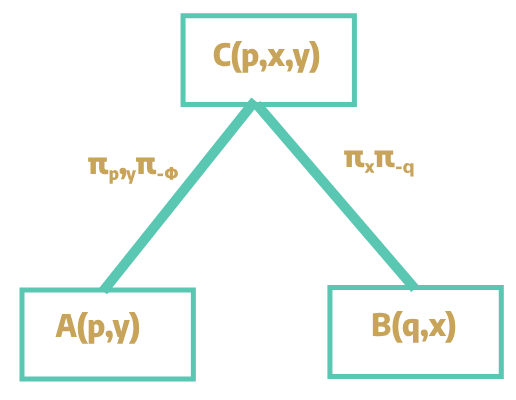
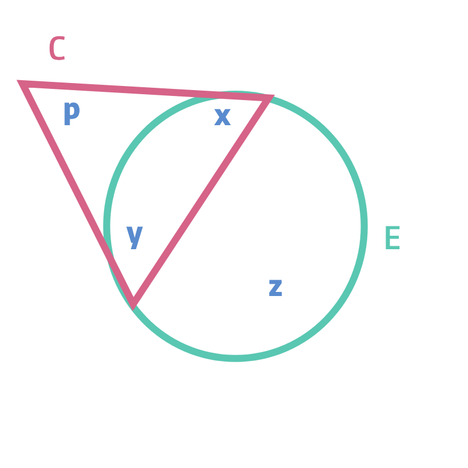
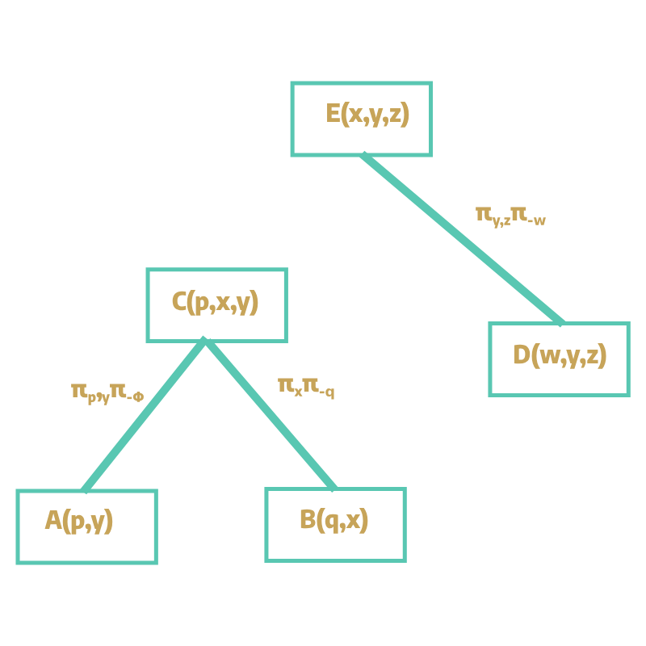
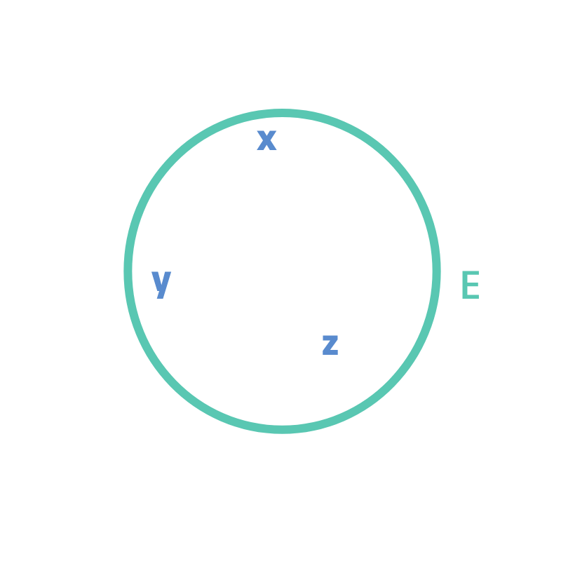
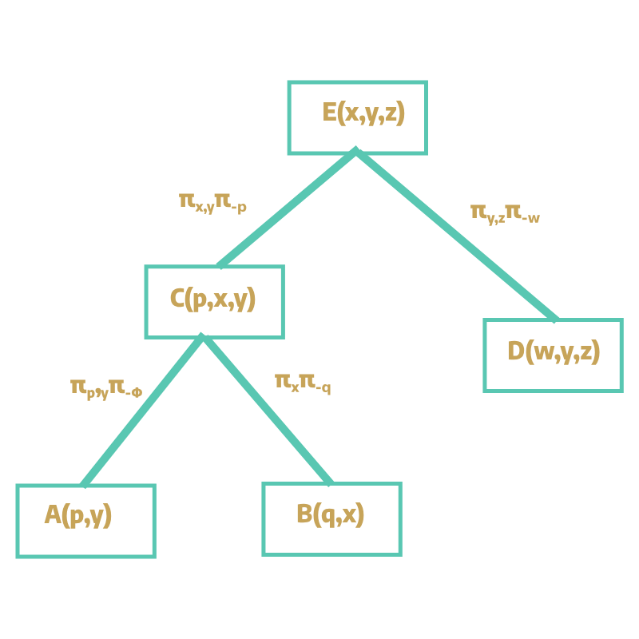

One of the major parts of a database management system is **query evaluation**.
A database query _q_ can be evaluated into multiple equivalent queries _q'1_, _q'2_, ..., _q'n_
The real challenge is to find the least costly or most efficient query among the pool of equivalent queries.

## Conjunctive queries

In relational algebra, a conjunctive queries or CQs can be defined as the following.

<Callout>
  A conjunctive query (CQ) is an expression that uses only the operations select
  σn=m, project π
  
    a1
  
  
    ,...,an
  , join ⋈, and renaming δ
    a1,...,an→b1,...,bn
  .
</Callout>

In SQL, conjunctive queries correspond to `SELECT FROM WHERE` queries, where the `WHERE`
conditions contain only equalities. The combined complexity of solving a conjunctive query is **_NP_** complete.
Some classes of CQs, however, can be computed in polynomial time.

## Acyclic CQs

The primary objective of query optimization is to find tractable case CQs.
Acyclic queries are the classes of CQs that can be computed in polynomial time.
Before diving into the why, let us look at a couple of definitions of acylic CQs.

<Callout>
<b>Definition 1</b> -- Conjunctive queries can be expressed in the form of a hypergraph. The hypergraph H(q) = (V, E) associated to a conjunctive query
q is defined as follows. The set of vertices V consists of all variables in the body of q, vars(q), while the set
E of hyperedges contains, for each atom in the query, the set of variables that appear in this atom. So by intuition, if a hypergraph representing CQ contains no cyles, it is acyclic.

</Callout>

A more formal definition of acyclic query can be given with the aid of GYO(Graham-Yu-Ozsoyoglu) algorithm. Before that, what is an ear in a hypergraph? An ear in a hypergraph H is a hyperedge e for which we can divide its nodes into two
groups:

1. those that appear exclusively in e, and
1. those that are contained in another hyperedge f of H.

Simply, if a hyperedge is isolated, or if it is contained within another hyperedge, it is by
definition an ear. Now we are ready to provide the second definition of acyclic CQs.

<Callout>
  <b>Definition 2</b> -- GYO reduction of a hypergraph is the process of
  repeatedly finding ears and removing them. If during this process, a
  hypergraph is reduced to nothing, then it is said to be acyclic.
</Callout>

It's very easy to get lost in words/definitions. GYO reduction is more illustratively defined in the following sections.

## The GYO reduction algorithm

The GYO algorithm works as follows:

<Callout>
  While <i>H</i> has ears do:
  <ol>
    <li>
      Pick an ear <i>e</i> of a hypergraph <i>H</i>.
    </li>
    <li>
      Remove all vertices that are exclusively in the ear <i>e</i>; remove the
      ear <i>e</i> from a set of hyperedges <i>E</i>.
    </li>
  </ol>
</Callout>

## Illustration of GYO reduction algorithm

Let us consider the following conjunctive query.

`Q:- A(p,y), B(q,x), C(p,x,y), D(w,y,z), E(x,y,z)`, where for `A(p,y)`, `A` is a relation whereas `p` and `y` are projected variables.

The following is the generated hypergraph for the above CQ. Here the variables are the nodes whereas the relations are the edges.

Now let's see the GYO reduction algorithm in place. First let's find the _ears_ in a hypergraph iteratively. Let's see if a hyperedge is isolated or completely contained in another hyperedge.
Immediately we can see that for the hyperedge A, both variables _p_ and _y_ are contained within C. Similarly since node _q_ is isolated and when removed the remaining nodes lie within hyperedge C,
we are left with the following hypergraph and join tree.

In the join tree, we keep track of the variables that are shared between the atoms.
For `A(p,y)`, we can see that it shares both `p` and `y` with `C(p,x,y)`. So the
join tree tracks πp,y(π-Φ). Similar is the case with `C(p,x,y)` and `B(q,x)`.

In the next pass, we can see node _w_ is isolated, and the remaining node `y` and `z` are contained within E, so edge D is consumed.
So, by GYO reduction we obtain the following hypergraph and join tree.

Finally, we repeat this process until we are left with the following hyper graph, and the complete join tree.

In the next blog, we will discuss the query evaluation part of acyclic queries through Yannakakis algorithm. Until then cheers !!

## References

1. Lecture 4: Acyclic conjunctive queries - University of Wisconsin–Madison. (n.d.). https://pages.cs.wisc.edu/~paris/cs784-f19/lectures/lecture4.pdf
1. YouTube. (2022). Toward Responsive DBMS (ICDE 2022 tutorial): Part 3 Acyclic Queries &amp; Enumeration. YouTube. Retrieved May 14, 2023, from https://www.youtube.com/watch?v=toi7ysuyRkw.
