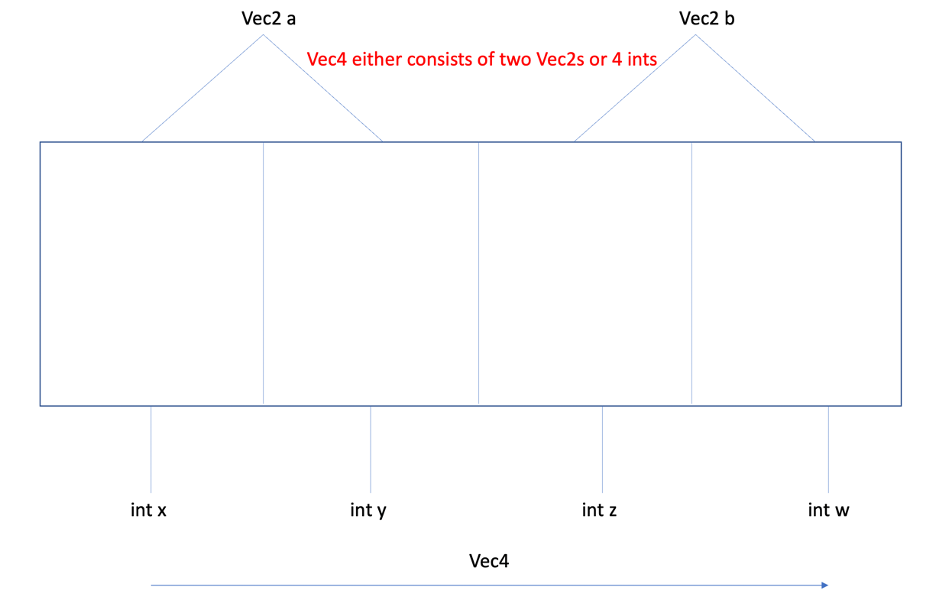
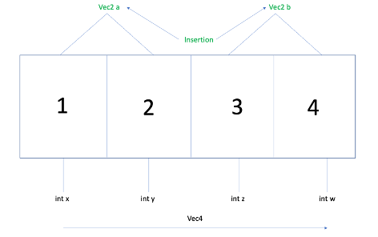
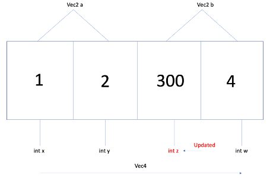
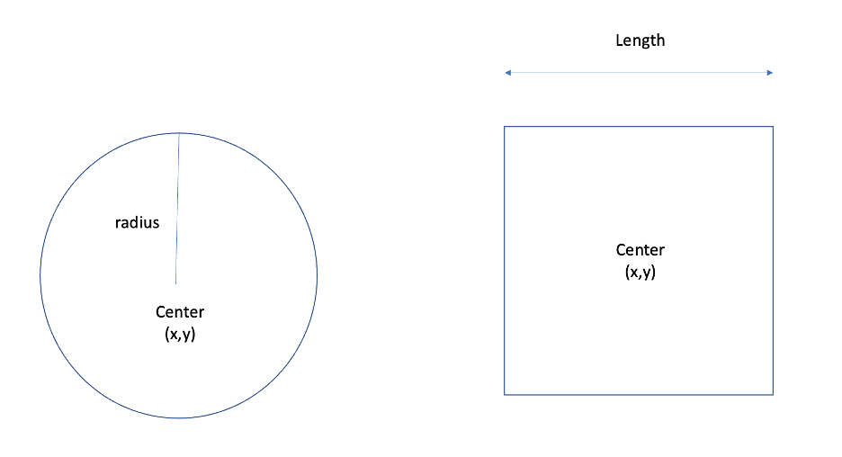

import { Callout } from "../../../src/components/atoms.js"

Before diving straight to tagged unions, let's have a brief introduction about unions.

<Callout>
💡 This tutorial assumes basic understanding of C/C++.

</Callout>

## Unions

Unions are similar to structs except that they only have enough memory to hold one member at a time. 
Often, unions provide flexibility to the programmer for different implementations of the same object, 
while also aiding memory utilization.

Let’s see where unions might prove useful. Let us consider a data structure **Vec4** which has four elements **x, 
y, z** and **w**. **Vec4** can either be defined by initializing each of the four elements or using two **Vec2**s 
(each **Vec2** has two elements). This is also shown below. 



The implementation can be done as follows. This implementation of **Vec4** allows us to initialize it using two **Vec2**s 
or individual **Vec4** elements, while utilizing the same memory.   

```c
typedef struct Vec2{
    int x,y;
} Vec2;
```

```c
typedef struct Vec4{
    union{
        struct 
        {
            Vec2 a,b;
        };
        struct{
            int x,y,z,w;
        };
    };
} Vec4;
```

To validate, let’s initialize a **Vec4** and make changes to the elements and logging the intermediate output.  

```c
//Initialize two vec2s
Vec2 p={1,2};
Vec2 q={3,4};

//Assign to vec4
Vec4 r;
r.a=p, r.b=q;

//Check values for int x,y,z,w
printf("x: %d, y: %d, z: %d, w: %d\n",r.x,r.y,r.z,r.w);
printf("Address of x: %p, Address if a.x: %p\n",&r.x, &r.a.x );

//Change value for z
r.z=300;
printf("a: { %d, %d }, b: { %d, %d }\n", r.a.x, r.a.y, r.b.x, r.b.y);
```

The figure below shows the insertion operation through **Vec2** elements on **Vec4**.
The same elements when read using **x**, **y**, **z**, and **w** show the inserted value.



The figure below shows that when **z** is updated, the value retrieved by **b.x** is also changed.



## Tagged Unions

Before we talk about tagged unions, let us consider a scenario where we have unions of different data types.

```c 
typedef struct MyData{
    union{
        int a;
        float b;
    };
} MyData;
```

Although, both data types consume 4 bytes (on 64-bit GCC), 
the way in which integers and float data types are represented in memory is completely different. 

```c 
MyData data;
data.a=4000;
data.b =3453.25f;
printf("%f, %d\n",data.b, data.a);
```

In this program, we are overwriting the memory consisting of an integer data type with a floating-point number, 
and accessing the integer data type. While accessing one data type after setting another member in a union is simply foolish, 
it is general convention to utilize same struct operations for an object, 
regardless of which union member is set. So, say, **MyData** struct needs to perform addition operation between two objects. 
It is necessary to know whether the integer or the float data type is set to perform correct operation. 
This is where tagged unions fit in. 

Tagged unions (also known as discriminated unions), consist of data types (usually occupying small space, 
with all members requiring nearabout same memory size) along with a special data type which identifies which member in the union is currently set.

```c 
typedef struct MyData{
    union{
        int a;
        float b;
        int member_set; //0 for int, 1 for float
    };
} MyData;
```

The **member_set** now allows the addition operation of any two **MyData** objects.

## Example 1

Let us consider an object which can either be a circle or a square. 
Implementing them as a union, how can we know which shape is set to perform object operations?



Here, the *enum* **Object_shape**, is used to determine which shape is set in the **Object** *struct*.

```c 
//Position data structure
typedef struct Position{
    int x;
    int y;
} Position;

//Circle and square shapes
typedef struct Circle{
    int radius;
    Position center;
} Circle;

typedef struct Square{
    int length;
    Position center;
} Square;

//Object shape enum
typedef enum Object_shape {
    Object_shape_circle,
    Object_shape_square
} Object_shape;

//Object structure
typedef struct Object
{
    Object_shape shape;
    union {

        Circle c;
        Square s;

    };

} Object;
```

Now to calculate the area of the object, we can simply produce a conditional statement.

```c 

Position p={1,2};
Circle c;
c.radius= 5;
c.center = p;
Object myObj;
myObj.shape=Object_shape_circle;
myObj.c=c;

//object area calculation using switch case
   switch (myObj.shape){
       case Object_shape_circle:
           printf("Circle area: %d\n",areaCircle(myObj));
           break;
       case Object_shape_square:
           printf("Square area: %d\n", areaSquare(myObj));
           break;
   }
```

## References

1.	Chernikov, Y. (2018, May 13). Unions in C++. YouTube. Retrieved December 22, 2021, from [https://www.youtube.com/watch?v=6uqU9Y578n4](https://www.youtube.com/watch?v=6uqU9Y578n4)
2.	Maclaine, A. (2019, September 10). C/C++ tagged/discriminated union. Medium. Retrieved December 22, 2021, from [https://medium.com/@almtechhub/c-c-tagged-discriminated-union-ecd5907610bf](https://medium.com/@almtechhub/c-c-tagged-discriminated-union-ecd5907610bf)


