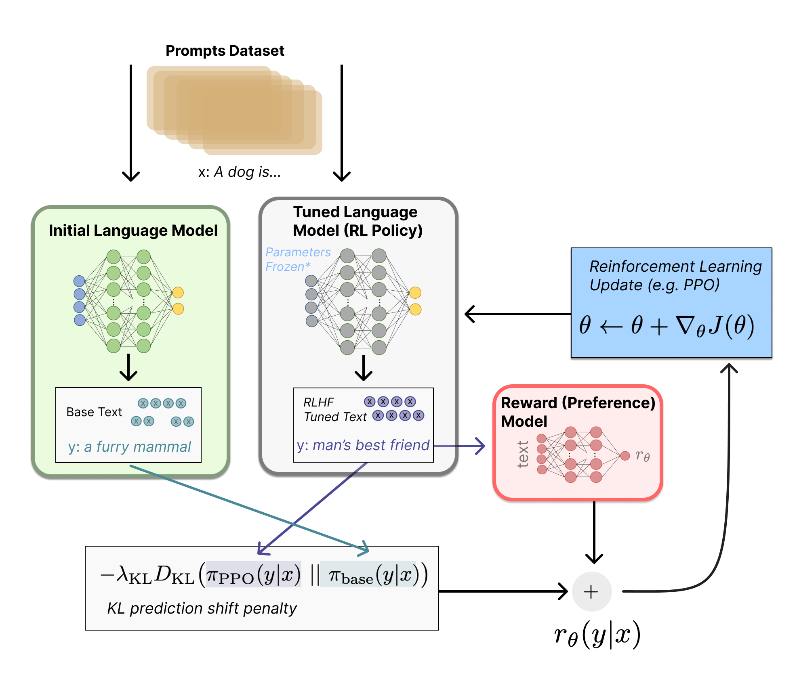
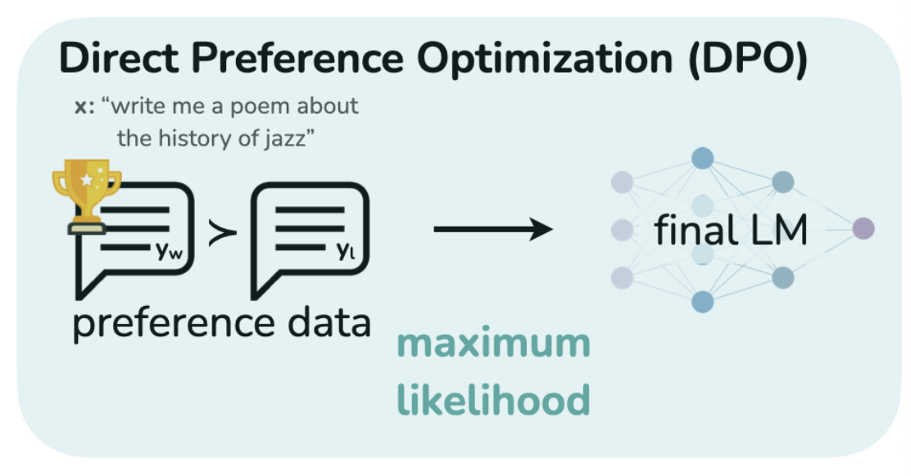

Large language models are excellent at predicting the next token, but that is not always the same thing as producing the answer a human would prefer.

If you ask a chatbot a question, there may be several plausible continuations. Some are correct, some are vague, and some completely miss the point. That gap between *likely text* and *preferred text* is exactly where alignment methods come in.

<Callout>
💡 This post gives the intuition behind DPO. You do not need to know reinforcement learning in detail to follow along.

</Callout>

## Why pretraining is not enough

During pretraining, a language model learns from raw text by predicting what comes next. This gives the model broad knowledge and fluent language ability, but it does not directly teach the model which answer is **more helpful**, **more truthful**, or **more aligned with user intent**.

Consider this question from the presentation:

> Who was the first person to walk on the moon?

A pretrained language model may assign high probability to several continuations:

- Neil Armstrong was the first person to walk on the moon.
- The Apollo 11 mission landed on the moon in 1969.
- Buzz Aldrin was also one of the first people to walk on the moon.

All of these continuations are related to the prompt, and some may even be factually useful in isolation. But if the user asked for the first person, the best answer is clearly the first one.

This is the gap preference data tries to close.

Instead of asking humans to always write the perfect answer, we can often ask a simpler question:

> Between these two responses, which one is better?

These pairwise comparisons are easier to collect and they carry a strong alignment signal.

## The usual solution: RLHF

The standard pipeline for this problem is **Reinforcement Learning from Human Feedback (RLHF)**.



*Image source: [Illustrating Reinforcement Learning from Human Feedback (RLHF)](https://huggingface.co/blog/rlhf), Hugging Face.*

At a high level, RLHF has three moving parts.

1. First, a base model is supervised fine-tuned.
2. Then, a separate **reward model** is trained to score responses using human preference data.
3. Finally, reinforcement learning updates the language model so that it produces higher-reward outputs.

This works well, but it is also a fairly heavy pipeline. We now have to train multiple models, tune a reinforcement learning loop, and carefully regularize the new policy so that it does not drift too far from the original model.

For large language models, that added complexity is not small.

## Where DPO comes in

Direct Preference Optimization (DPO) starts from a neat observation:

> We may not need a separate reward model and a reinforcement learning loop at all.

Instead of learning a reward model explicitly and then optimizing it, DPO directly trains the language model on preference pairs.



Suppose we have:

- a prompt `x`
- a preferred response `y_w`
- a rejected response `y_l`

DPO compares how much the current model likes the preferred response relative to the rejected one, and it also compares this behavior to a **reference model**. In effect, the update says:

> Increase the probability of the chosen answer, decrease the probability of the rejected one, but do it relative to the behavior of the reference model.

That is the key idea.

The reward signal is no longer handled by a separately trained network. It is baked into how the model scores responses.

The loss is usually written as:

```text
L_DPO(pi_theta; pi_ref) =
  - E_(x, y_w, y_l) ~ D [
      log sigma(
        beta log(pi_theta(y_w | x) / pi_ref(y_w | x))
        - beta log(pi_theta(y_l | x) / pi_ref(y_l | x))
      )
    ]
```

Let us break this down.

- `x` is the prompt.
- `y_w` is the winning response, the one humans preferred.
- `y_l` is the losing response, the one humans rejected.
- `pi_theta` is the model we are training.
- `pi_ref` is the frozen reference model, usually the supervised fine-tuned model before DPO starts.
- `pi_theta(y_w | x) / pi_ref(y_w | x)` asks how much more the new model likes the preferred response compared to the reference model.
- `pi_theta(y_l | x) / pi_ref(y_l | x)` asks the same question for the rejected response.
- `beta` controls how strongly we allow the new model to move away from the reference model.
- `sigma` is the sigmoid function, which turns the score difference into a probability-like value.

So the loss becomes small when the model gives the preferred response a higher relative score than the rejected one. If the model still prefers the bad answer, the loss becomes large and the update pushes it in the opposite direction.

## Why this is appealing

DPO is attractive for a few practical reasons.

- It removes the separate reward-model training step.
- It avoids online reinforcement learning rollouts.
- It is usually easier to train and reproduce than PPO-style RLHF.

This is why the method became popular so quickly. It preserves the central object we care about, human preference comparisons, while simplifying the optimization pipeline around them.

## A useful way to think about it

If RLHF says:

> Learn a reward first, then optimize the policy using RL.

DPO says:

> Use the preference pairs directly and update the policy in one supervised-style objective.

That reframing is what makes the method elegant.

It does not mean alignment becomes magically easy. Data quality still matters, preference labels can still be noisy, and results from the original paper were evaluated on relatively modest model scales compared to the largest systems used today. But as an optimization recipe, DPO is much cleaner than the older pipeline.

## Final thoughts

The main contribution of DPO is not that it changes the alignment goal. The goal is still the same: make the model produce responses humans prefer.

What it changes is the route we take to get there.

By removing the explicit reward-model-plus-RL loop, DPO turns preference alignment into a simpler and more stable learning problem. That simplicity is a big reason why it has become a standard baseline in modern LLM post-training.

## References

1. Rafailov, R., Sharma, A., Mitchell, E., Ermon, S., Manning, C. D., & Finn, C. (2023). *Direct Preference Optimization: Your Language Model is Secretly a Reward Model*.
2. Lambert, N., Castricato, L., von Werra, L., & Havrilla, A. (2022). *Illustrating Reinforcement Learning from Human Feedback (RLHF)*. Hugging Face. [https://huggingface.co/blog/rlhf](https://huggingface.co/blog/rlhf)
3. AI Coffee Break with Letitia. (2023). *Direct Preference Optimization: Your Language Model is Secretly a Reward Model | DPO paper explained* [Video]. YouTube. [https://www.youtube.com/watch?v=XZLc09hkMwA](https://www.youtube.com/watch?v=XZLc09hkMwA)
